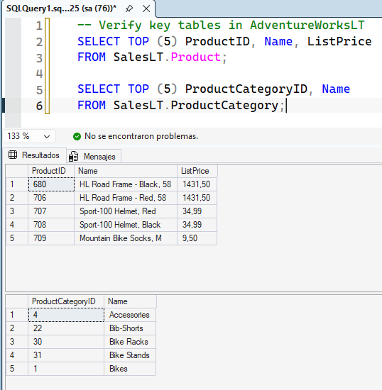
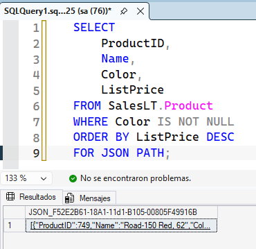
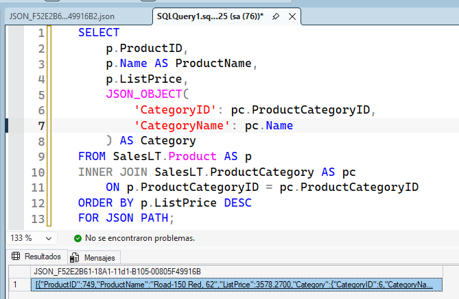
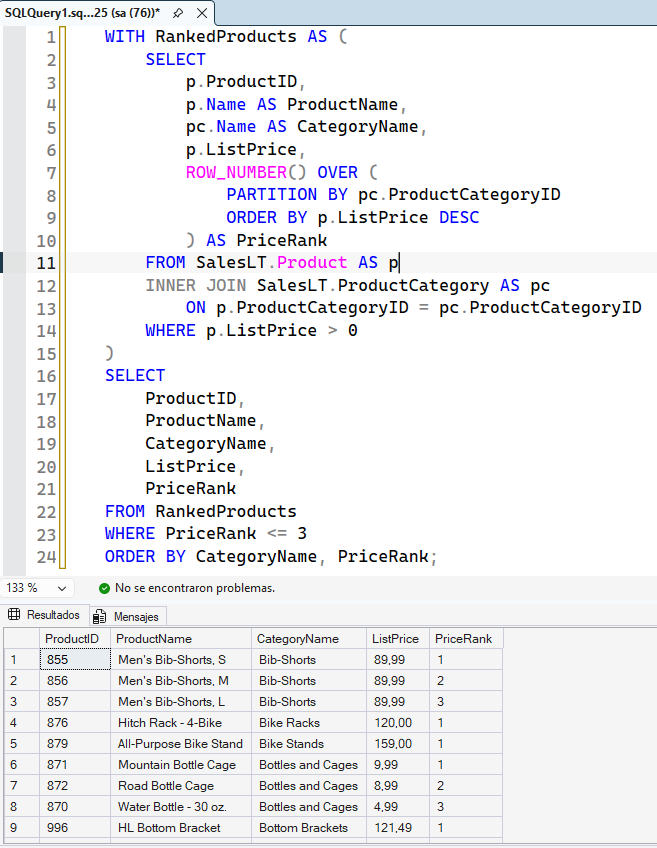
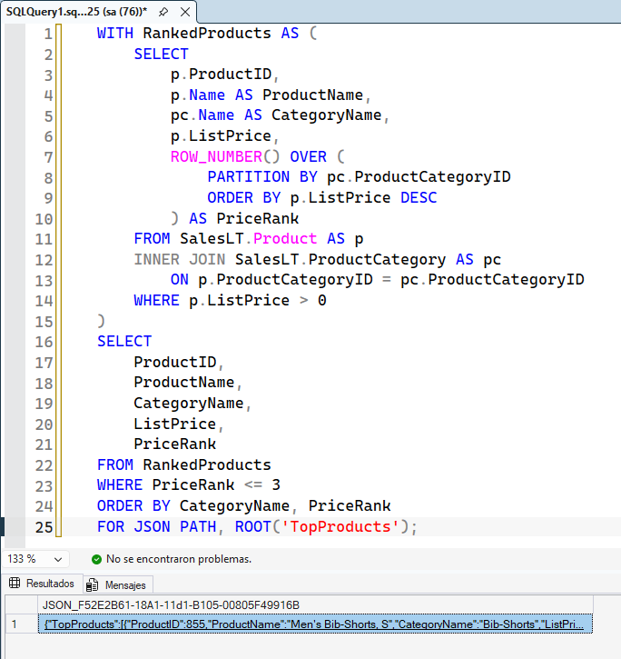
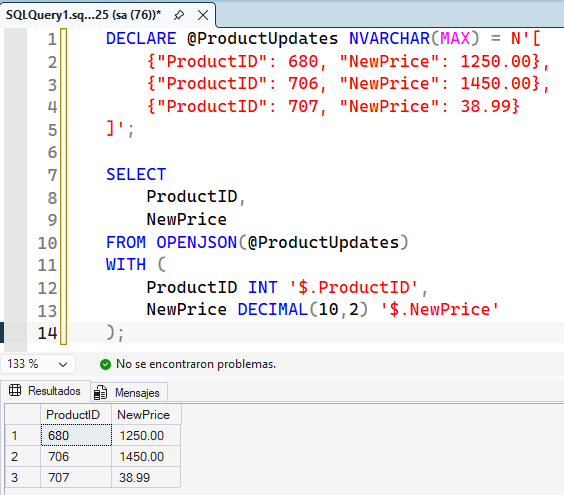
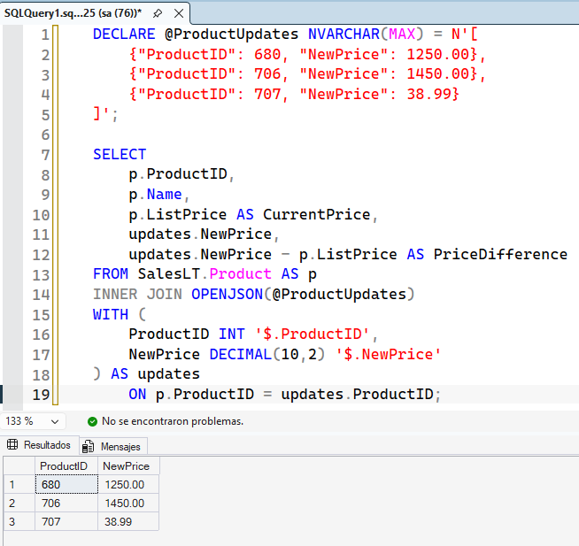

# Write advanced T-SQL queries

## Connect to AdventureWorksLT

Conexión a la base de datos AdventureWorksLT y verificación de las tablas clave: se consultan los 5 primeros registros de Product y ProductCategory para comprobar el acceso a los datos de productos y categorías.

## Build JSON output from product data

Generación de un objeto JSON simple a partir de la tabla Product utilizando `FOR JSON PATH`. La consulta selecciona productos con color asignado, los ordena de mayor a menor precio y formatea cada fila como un objeto dentro de un array JSON.

Creación de una estructura JSON anidada mediante el uso de `JSON_OBJECT`. Se realiza un `INNER JOIN` con ProductCategory para agrupar el identificador y el nombre de la categoría dentro de su propia propiedad anidada (Category) en la salida final.

## Combine JSON with a CTE and window function

Uso de una expresión de tabla común (CTE) y la función de ventana `ROW_NUMBER()` para calcular el ranking de precios de los productos. `PARTITION BY` reinicia la numeración en cada categoría, asignando el valor 1 al producto más caro, lo que permite filtrar posteriormente los 3 productos principales de cada grupo.

Formateo de los resultados del ranking directamente como JSON API agregando la cláusula `FOR JSON PATH, ROOT('TopProducts')`. Esto envuelve todo el array en un único objeto raíz, facilitando su consumo en aplicaciones externas.

## Parse JSON data with OPENJSON

Conversión de un array JSON de actualizaciones de precio en formato de filas y columnas utilizando la función `OPENJSON`. La cláusula `WITH` define el esquema, mapeando las rutas JSON (`$.ProductID`, `$.NewPrice`) a tipos de datos específicos de SQL Server.

Integración de los datos JSON analizados con la tabla base Product. Dado que `OPENJSON` genera una estructura tabular, se puede ejecutar un `INNER JOIN` clásico para comparar el precio actual con la propuesta de actualización en tiempo real.

